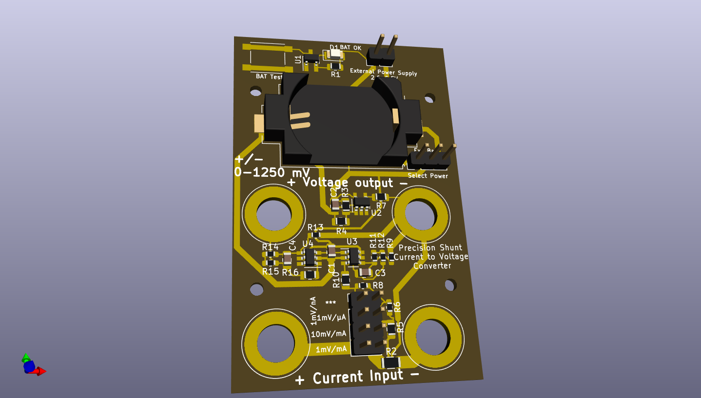

### ucurrent clone

This repository holds a clone of the ucurrent gold from https://www.eevblog.com/projects/ucurrent/

### Design changes
* Reimplementation of design in kicad
* exchanged switches for jumpers to reduce cost
* changed shunt usage which reduces accuracy of some measurement regions for simplicity
* used cheaper resistors for a reduced total accuracy which should be good enough for most use cases

### Description of range selection
Range selection happens by putting a jumper on the selector panel.
To change the range without powering of the device under test, just use a second jumper and remove the first one later.
The proposed sense resistors are:
* 10 milli ohms, selected in the most bottom row. (1 mV / mA)
* 90 + 10 milli ohms, selected by the second row from bottom (10 mV / mA, allows more precise measurements in the typical 0-125/250 mA region)
* 10,1 ohms (1.01 mV / µA; so 1 mV/µA with +1% error), selected by the third row from bottom. The measurement error can be mostly removed by setting a second jumper vertically on the bottom right to bridge R5.
* 10010,1 ohms (1.00101 mV / nA; so 1 mV/nA with + 0.1% error), selected by a vertical jumper on the top left)

### BOM changes
* Most precision resistors are available as 0.1% / 25ppm/K versions from the german distributor Reichelt.
* R5 has a special value of 90 mOhms and can be bridged if none can be obtained (or use a lower value).
* All shunt resistors are used as 1% versions. You are free to use more accurate ones to improve accuracy. I did rather safe 10 euros...
* The battery indication around the TPS3839 (compatible to TPS3809) is fully optional and activated by a push button. Device needs to be powered on!
* Power can be fed via an external source, power selection (external/battery/off) happens via jumper.

