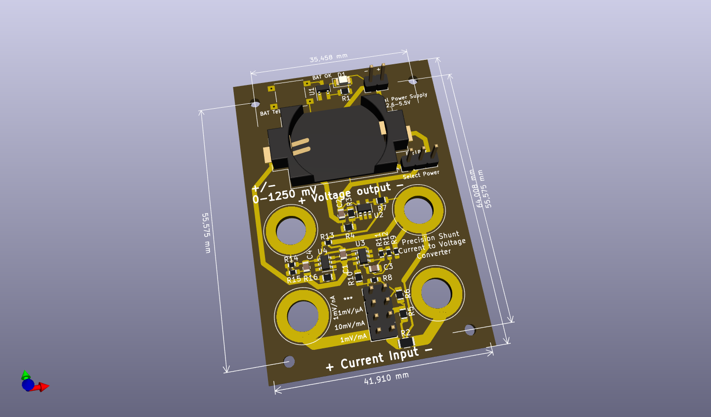
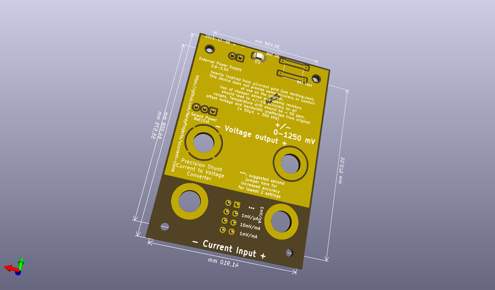
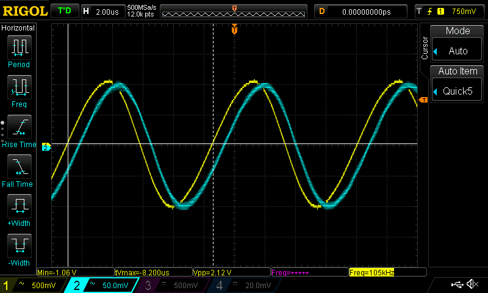
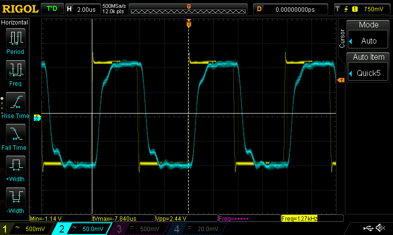

### ucurrent clone

This repository holds a clone of the ucurrent gold from https://www.eevblog.com/projects/ucurrent/

### Design changes
* Reimplementation of design in kicad
* exchanged switches for jumpers to reduce cost
* changed shunt usage which reduces accuracy of some measurement regions for simplicity
* used cheaper resistors for a reduced total accuracy which should be good enough for most use cases

### Description of range selection
Range selection happens by putting a jumper on the selector panel.
To change the range without powering of the device under test, just use a second jumper and remove the first one later.
The proposed sense resistors are:
* 10 milli ohms, selected in the most bottom row. (1 mV / mA)
* 90 + 10 milli ohms, selected by the second row from bottom (10 mV / mA, allows more precise measurements in the typical 0-125/250 mA region)
* 10,1 ohms (1.01 mV / µA; so 1 mV/µA with +1% error), selected by the third row from bottom. The measurement error can be mostly removed by setting a second jumper vertically on the bottom right to bridge R5.
* 10010,1 ohms (1.00101 mV / nA; so 1 mV/nA with + 0.1% error), selected by a vertical jumper on the top left)

### BOM changes
* Most precision resistors are available as 0.1% / 25ppm/K versions from the german distributor Reichelt.
* R5 has a special value of 90 mOhms and can be bridged if none can be obtained (or use a lower value).
* All shunt resistors are used as 1% versions. You are free to use more accurate ones to improve accuracy. I did rather safe 10 euros...
* The battery indication around the TPS3839 (compatible to TPS3809) is fully optional and activated by a push button. Device needs to be powered on!
* Power can be fed via an external source, power selection (external/battery/off) happens via jumper.

### BOM

| Count | Reference | Description | Purpose | Digikey | Reichelt | Price (total) |
| ---   | --------- | ----------- | ------- | ------- | -------- | ------------- |
| 1 | BT1 | CR2032 Battery Holder SMD | | 1060K-ND | | 1,05 € |
| 1 | - | Case 64x44x32mm | | | RND 455-00094 | 1,01 € |
| 2 | C1, C2 | Capacitor X7R 100 nF 0805 | blocking cap | | | 0,05 € |
| 2 | C3, C4 | Capacitor, 10 pF 0805 | opamp stabilization | | | 0,05 € |
| 2 | J2, J3, J6, J7 | Banana Jack 4mm red | measurement connections | | BIL 20 RT, BB 4 RT BD | 1,76 €, 0,64 € |
| 2 | J2, J3, J6, J7 | Banana Jack 4mm black | measurement connections | | BIL 20 SW, BB 4 SW BD | 1,76 €, 0,64 € | 
| 1 | J4 | jumper terminal, 1x03, 2,54mm | power selector | | | 0,05 € |
| 1 | J1 | jumper or screw terminal, 1x02, 2,54mm | external power | | | 0,20 € |
| 1 | J5 | double row connector, 02x04, 2,54mm | measurement range selection | | | 0,10 € |
| 4 | R1, R7, R10, R16 | Resistor 270 ohms 0805 (any) | | | | 0,05 € |
| 1 | R2 | Resistor 10 mOhms 1206 <= 1%, TC < 100 ppm | Shunt for 1mV/mA range | ERJ-6CWDR010V (0,5%, 75ppm)| | 0,75 € |
| 2 | R3, R4 | Resistor 100 kOhms 0805 (any) | voltage divider for VGND | | | 0,02 € |
| 1 | R5 | Resistor 90 mOhms 0805 <= 1%, TC < 100 ppm | Shunt for 10mV/mA range | WSL0805R0900FEA (1%, 75ppm) | | 0,85 € |
| 1 | R6 | Resistor 10 Ohms 0805 <= 1%, TC < 100 ppm | Shunt for 1mV/µA range | RR12Q10DCT-ND (0,5%, 50ppm) | | 0,13 € |
| 1 | R8 | Resistor 10 kOhms 0603 <= 1%, TC < 100 ppm | Shunt for 1mV/nA range | | SPR-0603 10,0K (0,1%, 25ppm) | 0,25 € |
| 2 | R9, R13 | Resistor 1 kOhms 0603 as precise as possible | amplifier feedback | | SPR-0603 1,00K (0,1%, 25ppm) | 0,50 € |
| 2 | R11, R14 | Resistor 6,8 kOhms 0603 as precise as possible | amplifier feedback | | SPR-0603 6,80K (0,1%, 25ppm) | 0,50 € |
| 2 | R12, R15 | Resistor 2,2 kOhms 0603 as precise as possible | amplifier feedback | | SPR-0603 2,20K (0,1%, 25ppm) | 0,50 € |
| 1 | SW1 or SW2 | Pushbutton 6mm | battery check | | RND 210-00207 | 0,12 € |
| 1 | U1 | TPS3839 | Power supply supervisor 2,65 V | TPS3839DBZ | | 0,74 € |
| 1 | U2 | LMV321 | opamp (generic) for VGND | LMV321LILT | | 0,43 € |
| 2 | U3, U4 | MAX4239AUT | ultra low offset/drift/noise opamp for measurement amplification | MAX4239AUT | | 5,30 € |
|   |        |            |                                                                  |            | | **SUM: 13,93 €** |

### Specs/Errata
Current usage of other ucurrent clone at 2.7V: 1.004 mA (via Multimeter) or 1.04 mA (via ucurrent clone @ 1mV/µA).
Unfortunately, there is a bunch of problems, which also seem to exist in the original ucurrent, but have different levels of manifestation.

* Oscillations of reference voltage: Original ucurrent gold seems to be sensitive about the exact type of U2. I tried two versions and have not been successful. Placing 100nf each over R4 and from GNDREF to V- makes GNDREF stable. This can easily be done by soldering 100nf directly above R4 and another 100nf 1206 from R13 to R4.
* Oscillations/feedback when using nA range: When operated in the nA range the output oscillates with 100kHz-1MHz. It looks like feedback is picked up in the first x10 stage and propagated to the output. Reducing bandwidth by placing 5nF from U3/pin3 (IN+) to GNDREF stops the feedback but reduces bandwidth to ~10 kHz.
* Reduced bandwidth: Output voltage drops significantly above 100 Khz.

Some scope shots, CH1 voltage over a 10 kOhm resistor, CH2 output voltage of ucurrent clone

